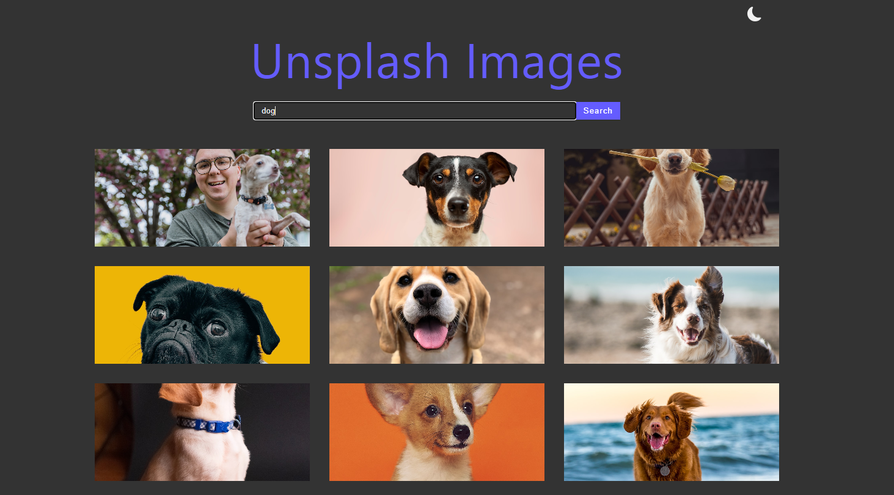
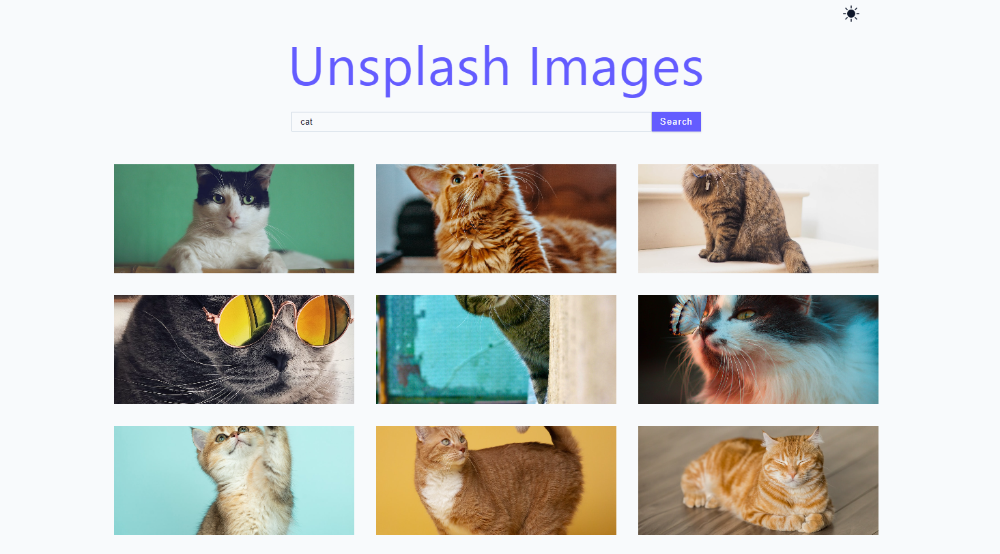

## Unsplash Images

This is a website for getting images from the Unsplash Images API. You have the user search for an image in the search bar and you use that search term with the Unsplash API to get the images.

Link: https://react-images-unsplash.netlify.app/

# Tools Used

- HTML for displaying the content
- CSS and Styled Components for styling the website
- Javascript for rendering the content on the website and for dynamic behaviour
- React for creating reusable components and help with management of data
- Context API for state management
- Axios for fetching data
- Serverless functions for grabbing data from the API

# Images

# Link

Link: https://react-images-unsplash.netlify.app/
